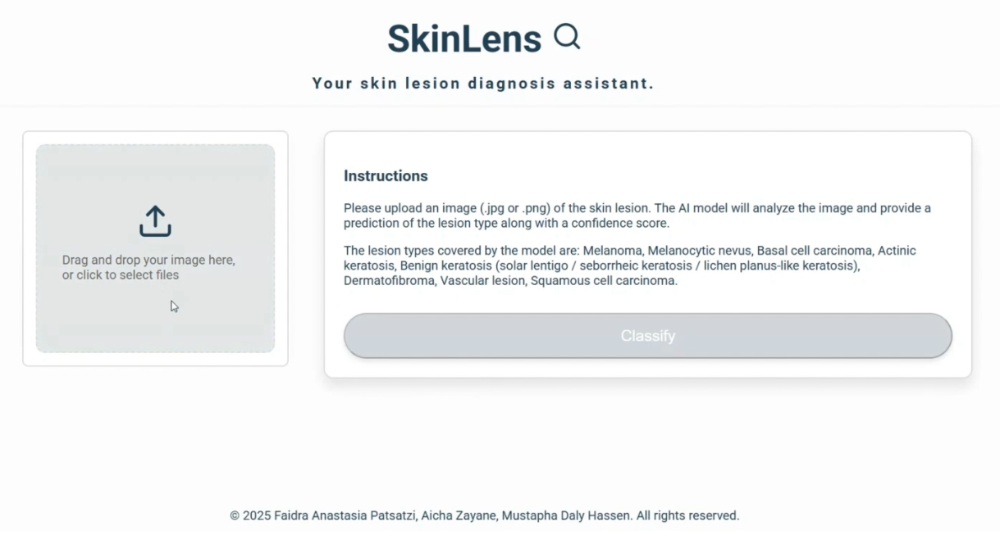

# SkinLens: Interactive Skin Lesion Diagnosis using CNNs

SkinLens is a web application designed to assist in the diagnosis of skin lesions. Users can upload high-quality images of skin lesions, which are then classified using a convolutional neural network. This tool aims to provide an interactive and accurate diagnosis suggestion to help in early detection and treatment.



## Project Structure
```php
skin-lens/
│── .gitignore              # Git ignore file
│── LICENSE                 # License file
│── README.md               # Project documentation
│── api/                    # Backend server for model inference
│   ├── main.py             # FastAPI entry point
│   ├── readme.md           # API specific documentation
│   ├── requirements.txt    # Backend dependencies
│   ├── models/             # Model (trained weights, model loading)
│   │   ├── __init__.py
│   │   ├── checkpoint_epoch__effnet_b1_35.pth
│   │   ├── cnn_model.py
│   ├── routes/             # API routes for handling requests
│   │   ├── __init__.py
│   │   ├── classify_routes.py
│   ├── utils/              # Utility functions (preprocessing)
│       ├── __init__.py
│       ├── image_processing.py
│── frontend/               # Frontend application
│   ├── .babelrc            # Babel configuration
│   ├── package.json        # Frontend dependencies
│   ├── webpack.config.js   # Webpack configuration
│   ├── public/             # Static assets
│   ├── src/                # React components
│       ├── App.js          # Main frontend app
│       ├── index.js        # Entry point
│       ├── index.css       # Global styles
│       ├── components/     # UI components
│       ├── pages/          # React pages
│           ├── Home.jsx
│           ├── LandingPage.jsx
│── notebooks/              # Jupyter Notebooks for model training
│   ├── resnet18_transfer_isic2019.ipynb
```

### API Description

The SkinLens API is built using FastAPI and serves a Convolutional Neural Network (CNN) model for image classification. The model used is EfficientNet-B1, which has been trained on the ISIC 2019 dataset for skin lesion classification (multiclass classification, 8 classes). The API provides endpoints for image classification and is designed to handle image uploads, preprocess the images, and return classification results.

#### How It Works

1. **Image Upload**: Users upload an image of a skin lesion through the frontend.
2. **Image Preprocessing**: The uploaded image is preprocessed to match the input requirements of the CNN model.
3. **Model Inference**: The preprocessed image is passed through the EfficientNet-B1 model to obtain classification results.
4. **Result**: The classification results, including the predicted class and confidence score, are returned.

### API Endpoints

- **GET /**: Returns a welcome message.
- **POST /api/classify**: Accepts an image file and returns the classification result (class and confidence score).


## How to Run Locally
### API

1. **Create a Virtual Environment**

   First, create a virtual environment to isolate the project's dependencies. You can use `venv` for this purpose.

   #### On Unix-based systems:
   ```sh
   python3 -m venv venv
   source venv/bin/activate
   ```

   #### On Windows:
   ```sh
   python -m venv venv
   venv\Scripts\activate
   ```

2. **Install Dependencies**

   With the virtual environment activated, install the required dependencies using the `requirements.txt` file.
   ```sh
   pip install -r api/requirements.txt
   ```

3. **Run the FastAPI Application**

   Use `uvicorn` to run the FastAPI application.
   ```sh
   uvicorn api.main:app --reload
   ```

   The server will start, and you can access the API at [http://127.0.0.1:8000/api/classify](http://127.0.0.1:8000/api/classify).

### Frontend

1. **Navigate to the Frontend Directory**

   ```bash
   cd frontend
   ```

2. **Install Project Dependencies**

   ```bash
   npm install
   ```

3. **Run the Webpack Server in Development Mode**

   ```bash
   npm run dev
   ```

   The frontend application will start, and you can access it at [http://localhost:3000](http://localhost:3000).

## Additional Information

### Frontend Components

- **App.js**: Main application component that sets up routing.
- **Home.jsx**: Page component for the skin lesion classifier.
- **LandingPage.jsx**: Landing page component.
- **Button.js**: UI component for buttons.
- **Card.js**: UI component for cards.
- **CardContent.js**: UI component for card content.

### Styling

- **Tailwind CSS**: Used for utility-first CSS styling.
- **Custom Styles**: Defined in `src/index.css`.

### Development Tools

- **Webpack**: Module bundler for the frontend.
- **Babel**: JavaScript compiler for using the latest JavaScript features.
- **PostCSS**: Tool for transforming CSS with JavaScript plugins.

## License

This project is licensed under the MIT License - see the [LICENSE](LICENSE) file for details.